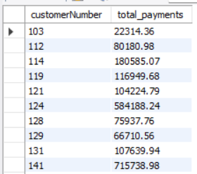

# Vehicle_Sales
## Project Overview:
The classicmodels database is a sample database designed to illustrate how a relational database works in a small business context. It provides a practical example for learning and testing SQL queries, database design principles, and relational database management systems (RDBMS) concepts.

This sample database includes tables representing various business entities such as customers, employees, products, orders, and payments. The data and relationships between these tables are structured to showcase common scenarios in business operations, making it an excellent resource for both beginners and experienced users looking to improve their SQL skills or test database applications.

# Tools & Library Used
 &nbsp;

# Query Task

1. Find the total number of customers.

 &nbsp;

2. Retrieve the customer details for those whose credit limit is above $50,000.

 &nbsp;

3. List the employees who work in a specific office, say officeCode '1'.

 &nbsp;

4. List customers from a specific country, say 'USA'.

 &nbsp;

5. Find the number of employees reporting to each manager.

 &nbsp;

6. Retrieve the names of employees who have no direct reports.

 &nbsp;

7. Find the total number of offices in each country.
   
 &nbsp;

8. Find the details of the top 5 products with the highest order quantity.

 &nbsp;

9. Calculate the total price for each order (quantity times price each).

 &nbsp;

10. List all orders placed by a specific customer, say with customerNumber 103.

 &nbsp;

11. Find the number of orders placed in each status category.

 &nbsp;

12. Retrieve the payment details of customers who have made payments above $50,000.

 &nbsp;

13. Calculate the total payments made by each customer.

 &nbsp;

14. Count the number of products in each product line.

 &nbsp;

15. Find the top 5 most expensive products.

 &nbsp;

16. List all products with a buy price between $50 and $100.

 &nbsp;

17. List all customers and their corresponding orders, including customers who havent placed any orders.

 &nbsp;

18. List all employees and their assigned customers, including employees who have no assigned customers.

 &nbsp;

19. Retrieve all order details and their corresponding products, including order details for products that are no longer in the products table.

 &nbsp;
